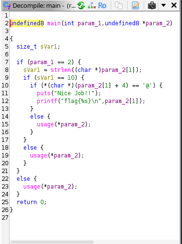

# easy_reverse - Crackmes.one Write-up

## Informasi Challenge

| Informasi | Keterangan |
|-----------|------------|
| **Nama Challenge** | easy_reverse |
| **Author** | cbm-hackers |
| **Platform** | Unix/Linux |
| **Bahasa** | C/C++ |
| **Difficulty** | 1.3 |
| **Kategori** | Reverse Engineering |
| **Tools** | Ghidra |

---

# Deskripsi

Challenge **easy_reverse** merupakan sebuah crackme sederhana yang berfokus pada analisis statis (*static analysis*). Tujuan utama challenge ini adalah memahami bagaimana program menerima **Command Line Argument (CLA)**, kemudian menganalisis logika validasi password yang digunakan sebelum program menampilkan flag.

Pada challenge ini tidak diperlukan teknik reverse engineering yang kompleks seperti debugging ataupun patching, karena seluruh logika validasi dapat diketahui melalui proses dekompilasi menggunakan **Ghidra**.

---

# Analisis Awal

Langkah pertama adalah menjalankan program tanpa memberikan argumen apa pun.

```bash
$ ./easy_reverse
```

Output:

```text
usage: ./easy_reverse <password>
```

Dari output tersebut dapat disimpulkan beberapa hal:

- Program **tidak meminta input secara interaktif** melalui keyboard.
- Password harus diberikan sebagai **command line argument**.
- Jika jumlah argumen tidak sesuai, program akan langsung menampilkan pesan penggunaan (*usage*).

---

# Analisis Menggunakan Ghidra

Selanjutnya file biner dibuka menggunakan **Ghidra** untuk melihat hasil dekompilasi fungsi `main()`.



Dari hasil dekompilasi terlihat bahwa proses validasi dilakukan dalam tiga tahap.

---

## 1. Validasi Jumlah Argumen

Potongan kode berikut merupakan pengecekan pertama yang dilakukan program.

```c
if (param_1 == 2)
```

Pada hasil dekompilasi Ghidra:

- `param_1` merupakan `argc`
- `param_2` merupakan `argv`

Karena nilai yang diperiksa adalah `2`, maka program mengharapkan:

| Argumen | Isi |
|---------|-----|
| `argv[0]` | Nama program (`./easy_reverse`) |
| `argv[1]` | Password |

Apabila jumlah argumen tidak sama dengan dua, program akan langsung mencetak pesan:

```text
usage: ./easy_reverse <password>
```

dan proses berhenti.

---

## 2. Validasi Panjang Password

Setelah jumlah argumen benar, program menghitung panjang string menggunakan fungsi `strlen()`.

```c
sVar1 = strlen(param_2[1]);

if (sVar1 == 10)
```

Artinya password **harus memiliki panjang tepat 10 karakter**.

Jika jumlah karakter kurang atau lebih dari 10, maka validasi akan gagal.

---

## 3. Validasi Karakter Kelima

Tahap terakhir adalah pengecekan terhadap salah satu karakter pada password.

```c
if (*(char *)(param_2[1] + 4) == '@')
```

Potongan kode tersebut menggunakan **pointer arithmetic**.

Ekspresi:

```c
param_2[1] + 4
```

berarti pointer digeser sejauh **4 byte** dari awal string.

Karena indeks string dimulai dari **0**, maka karakter yang diperiksa adalah:

| Indeks | Posisi |
|--------|---------|
| 0 | Karakter pertama |
| 1 | Karakter kedua |
| 2 | Karakter ketiga |
| 3 | Karakter keempat |
| **4** | **Karakter kelima** |

Karakter pada posisi tersebut **harus berupa simbol `@`**.

---

# Menyusun Password

Berdasarkan seluruh hasil analisis sebelumnya, password yang diterima program harus memenuhi dua syarat berikut:

1. Panjang password **10 karakter**.
2. Karakter ke-5 harus berupa **`@`**.

Program **tidak membandingkan keseluruhan string**, sehingga karakter selain posisi kelima dapat berupa karakter apa pun selama kedua syarat di atas terpenuhi.

Sebagai contoh digunakan payload berikut:

```text
AAAA@BBBBB
```

Validasi:

| Syarat | Hasil |
|---------|-------|
| Panjang 10 karakter | ✅ |
| Karakter ke-5 adalah `@` | ✅ |

---

# Proof of Concept

Jalankan program dengan password yang telah memenuhi seluruh aturan.

```bash
$ ./easy_reverse AAAA@BBBBB
```

Output:

```text
Nice Job!!
flag{AAAA@BBBBB}
```

Program menerima input tersebut karena telah lolos seluruh proses validasi.

---

# Flag

```text
flag{AAAA@BBBBB}
```

---

# Kesimpulan

Challenge ini merupakan pengenalan yang baik untuk memahami proses **reverse engineering** menggunakan pendekatan **static analysis**.

Beberapa konsep dasar yang dipelajari dari challenge ini antara lain:

- Memahami penggunaan **Command Line Argument (argc dan argv)**.
- Mengenali proses validasi string menggunakan fungsi `strlen()`.
- Memahami konsep **pointer arithmetic** pada bahasa C.
- Membaca hasil dekompilasi menggunakan **Ghidra** untuk menemukan logika program tanpa harus menjalankannya melalui debugger.

Walaupun tingkat kesulitannya rendah, challenge ini memberikan dasar yang penting sebelum mempelajari crackme yang memiliki mekanisme validasi lebih kompleks seperti operasi bitwise, enkripsi sederhana, maupun teknik obfuscation.