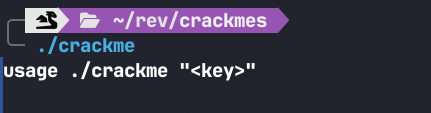
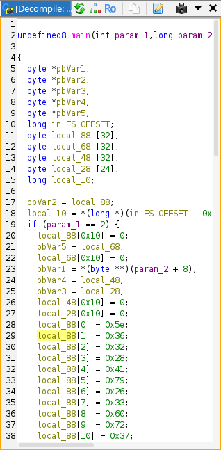
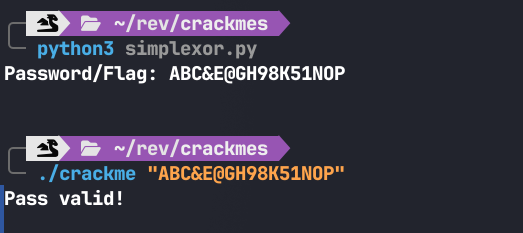

# YandereMia's Simple XOR Crackme - Crackmes.one Write-up

## Informasi Challenge

| Informasi | Keterangan |
|-----------|------------|
| **Nama Challenge** | YandereMia's Simple XOR Crackme |
| **Author** | YandereMia |
| **Platform** | Unix/Linux (x86-64) |
| **Bahasa** | C/C++ |
| **Difficulty** | 2.0 |
| **Kategori** | Reverse Engineering |
| **Teknik Utama** | Static Analysis, XOR Analysis |
| **Tools** | Ghidra, Python |

---

# Deskripsi

Challenge ini merupakan crackme tingkat pemula yang berfokus pada analisis logika validasi password menggunakan operasi **XOR (Exclusive OR)**. Tujuan utama challenge adalah menemukan key yang benar sehingga program menampilkan pesan:

```text
Pass valid!
```

Sesuai deskripsi challenge, penyelesaian dilakukan dengan **static analysis** tanpa melakukan patching terhadap binary.

---

# Analisis Awal

Sebelum melakukan proses reverse engineering, langkah pertama adalah mengidentifikasi jenis file binary menggunakan utilitas `file`.

```bash
$ file crackme
```

Output:

```text
crackme: ELF 64-bit LSB pie executable, x86-64, version 1 (SYSV)...
```

Selanjutnya diberikan hak akses eksekusi, kemudian binary dijalankan.

```bash
$ chmod +x crackme
$ ./crackme
```

Output:

```text
usage ./crackme "<key>"
```

Dari hasil tersebut dapat disimpulkan bahwa:

- Binary merupakan executable ELF 64-bit.
- Program menerima input melalui **command line argument**.
- Program mengharapkan satu buah key sebagai parameter.



---

# Analisis Menggunakan Ghidra

Binary kemudian dibuka menggunakan **Ghidra** untuk melihat hasil dekompilasi fungsi `main()`.



Selama proses analisis ditemukan dua bagian penting, yaitu inisialisasi array dan proses validasi password.

---

## 1. Inisialisasi Array

Pada awal fungsi `main()`, program mengisi empat buah array yang masing-masing terdiri dari 16 byte.

Contoh hasil dekompilasi:

```c
local_88[0] = 0x5e;
local_88[1] = 0x36;
/* ... */

local_68[0] = 0x36;
local_68[1] = 0x69;
/* ... */

local_48[0] = 0x3a;
local_48[1] = 0x76;
/* ... */

local_28[0] = 0x33;
local_28[1] = 0x4b;
/* ... */
```

Keempat array tersebut masing-masing memiliki panjang **16 byte** dan digunakan sebagai data utama pada proses validasi.

Hal ini juga menunjukkan bahwa key yang benar memiliki panjang **16 karakter**.

---

## 2. Analisis Logika Validasi

Bagian terpenting terdapat pada perulangan berikut.

```c
do {
    if (*pbVar1 !=
        (byte)(*pbVar2 ^ *pbVar3 ^ *pbVar5 ^ *pbVar4 ^ 0x20))
    {
        puts("Nope.");
        goto LAB_00101176;
    }

    pbVar1++;
    pbVar2++;
    pbVar3++;
    pbVar4++;
    pbVar5++;

} while (pbVar2 != local_88 + 0x10);

puts("Pass valid!");
```

Program membandingkan setiap karakter input dengan hasil operasi XOR dari empat array.

Secara sederhana proses validasinya dapat dituliskan sebagai:

```text
Input = Array1 ^ Array2 ^ Array3 ^ Array4 ^ 0x20
```

Jika terdapat satu karakter saja yang tidak sesuai, program akan langsung menampilkan:

```text
Nope.
```

Sebaliknya, apabila seluruh karakter sesuai, maka program akan mencetak:

```text
Pass valid!
```

---

## Mengapa XOR?

Operator **XOR** memiliki sifat yang sangat berguna dalam reverse engineering.

Misalnya:

```text
A ^ B = C
```

Maka nilai yang hilang dapat diperoleh kembali dengan:

```text
C ^ B = A
```

Karena sifat tersebut, kita tidak perlu melakukan brute-force terhadap password. Cukup mengambil seluruh data array dari binary, kemudian melakukan operasi XOR kembali untuk memperoleh key asli.

---

# Menyusun Solver

Untuk memperoleh password secara otomatis, dibuat sebuah script Python sederhana.

```python
A = [0x5e, 0x36, 0x32, 0x28, 0x41, 0x79, 0x26, 0x33,
     0x60, 0x72, 0x37, 0x6a, 0x7c, 0x51, 0x7d, 0x3e]

B = [0x36, 0x69, 0x75, 0x37, 0x28, 0x69, 0x55, 0x42,
     0x70, 0x44, 0x24, 0x39, 0x4b, 0x6c, 0x49, 0x43]

C = [0x3a, 0x76, 0x54, 0x33, 0x3f, 0x5b, 0x5a, 0x7d,
     0x63, 0x56, 0x27, 0x6f, 0x66, 0x38, 0x3f, 0x43]

D = [0x33, 0x4b, 0x70, 0x2a, 0x33, 0x2b, 0x4e, 0x64,
     0x6a, 0x78, 0x5f, 0x29, 0x40, 0x6b, 0x64, 0x4e]

flag = ""

for i in range(16):
    flag += chr(A[i] ^ B[i] ^ C[i] ^ D[i] ^ 0x20)

print(flag)
```

Script tersebut mengambil seluruh byte dari keempat array kemudian menghitung hasil XOR untuk memperoleh setiap karakter password.

---

# Proof of Concept

Jalankan solver.

```bash
$ python3 simplexor.py
```

Output:

```text
Password: ABC&E@GH98K51NOP
```

Kemudian gunakan password tersebut untuk menjalankan binary.

```bash
$ ./crackme "ABC&E@GH98K51NOP"
```

Output:

```text
Pass valid!
```



---

# Flag / Valid Key

```text
ABC&E@GH98K51NOP
```

---

# Kesimpulan

Challenge ini memperkenalkan konsep dasar penggunaan operasi **XOR** dalam proses validasi password. Meskipun algoritmanya terlihat sederhana, teknik seperti ini cukup sering ditemukan pada challenge reverse engineering tingkat pemula karena mengajarkan cara membaca pseudocode dan memahami alur program.